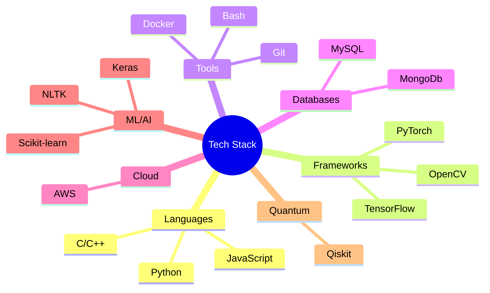

<div align="center">
  
</div>


<h3 align="center">
ML Developer | Code Weaver | Digital Alchemist
</h3>

<p align="center">
  <a href="https://github.com/ka-us-tubh">
    
  </a>
  <a href="https://twitter.com/kaustub25522311">
    
  </a>
</p>

---


<div align="center">
  
```diff
@@   NEURAL NETWORK INITIALIZATION...   @@
+ Quantum Entanglement: Established
- Dark Matter Reactor: Online
! AI Core: Version 3.141592653589793
# Deep Learning Modules: Loaded
$ Cybernetic Enhancements: Activated
& Time-Space Continuum: Stabilized
```

</div>


### 📡 SUBSPACE COMMUNICATION CHANNELS

<p align="center">
  <a href="https://twitter.com/kaustub25522311" target="_blank">
    
  </a>
  <a href="https://www.linkedin.com/in/kaustubh-gupta-79a65b21b/" target="_blank">
    
  </a>
  <a href="https://medium.com/@kaustubhg10" target="_blank">
    
  </a>
  <a href="mailto:kaustubhg10@gmail.com">
    
  </a>
</p>

---

### 🛸 INTERDIMENSIONAL TOOLKIT

<div align="center">



</div>

---

### QUANTUM REALM ANALYTICS

<div align="center">
  
</div>

<div align="center">
  
</div>

<div align="center">
  
</div>

---

### COSMIC CODE CONTRIBUTIONS

<div align="center">
  
</div>

<div align="center">
  
  
</div>

---

<div align="center">
  
</div>


<div align="center">

```
 /$$   /$$  /$$$$$$  /$$   /$$  /$$$$$$  /$$$$$$$$ /$$   /$$ /$$$$$$$  /$$   /$$
| $$  /$$/ /$$__  $$| $$  | $$ /$$__  $$|__  $$__/| $$  | $$| $$__  $$| $$  | $$
| $$ /$$/ | $$  \ $$| $$  | $$| $$  \__/   | $$   | $$  | $$| $$  \ $$| $$  | $$
| $$$$$/  | $$$$$$$$| $$  | $$|  $$$$$$    | $$   | $$  | $$| $$$$$$$ | $$$$$$$$
| $$  $$  | $$__  $$| $$  | $$ \____  $$   | $$   | $$  | $$| $$__  $$| $$__  $$
| $$\  $$ | $$  | $$| $$  | $$ /$$  \ $$   | $$   | $$  | $$| $$  \ $$| $$  | $$
| $$ \  $$| $$  | $$|  $$$$$$/|  $$$$$$/   | $$   |  $$$$$$/| $$$$$$$/| $$  | $$
|__/  \__/|__/  |__/ \______/  \______/    |__/    \______/ |_______/ |__/  |__/
```
'''
COMMIT VISUALIZATION
                 ==========================================
                                                                  ┌────────┐
                                                     █████████████┤ Commits│
                                          ████████████████████████┤   100+ │
                               ███████████████████████████████████┤ 50-99  │
                    ██████████████████████████████████████████████┤ 20-49  │
         ███████████████████████████████████████████████████████████ 1-19  │
Year  ┌───┴───┬───┴───┬───┴───┬───┴───┬───┴───┬───┴───┬───┴───┬───┴───┐    │
2023  │       │    ▓  │    ▓  │   ▓▓  │  ▓▓▓  │  ▓▓▓  │ ▓▓▓▓  │▓▓▓▓▓▓ │    │
      │       │   ▓   │   ▓   │  ▓▓   │ ▓▓▓   │ ▓▓▓   │▓▓▓▓   │▓▓▓▓▓▓ │    │
      │       │  ▓    │  ▓    │ ▓▓    │▓▓▓    │▓▓▓    │▓▓▓▓   │▓▓▓▓▓▓ │    │
      │       │ ▓     │ ▓     │▓▓     │▓▓     │▓▓     │▓▓▓    │▓▓▓▓▓  │    │
2022  │       │▓      │▓      │▓      │▓      │▓      │▓▓     │▓▓▓▓   │    │
      │    ▒  │▒      │▒      │▒      │▒      │▒      │▒▒     │▒▒▒    │    │
      │   ▒   │       │       │       │       │       │▒      │▒▒     │    │
      │  ▒    │       │       │       │       │       │       │▒      │    │
2021  │ ▒     │       │       │       │       │       │       │       │    │
      │░      │       │       │       │       │       │       │       │    │
      ├───────┼───────┼───────┼───────┼───────┼───────┼───────┼───────┤    │
      Q1      Q2      Q3      Q4      Q1      Q2      Q3      Q4      └────┘
         2021                      2022                   2023
'''
</div>
